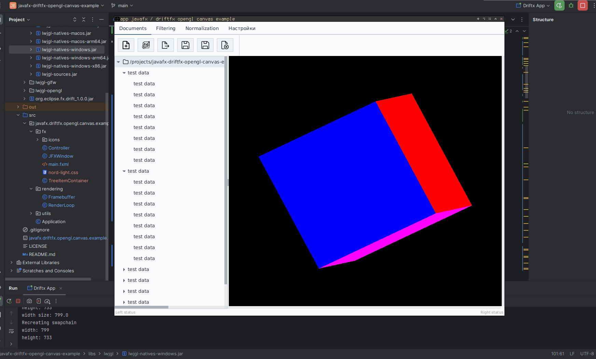

# Javafx driftfx opengl canvas example
Based on https://github.com/ReikaKalseki/GameCalendar 
Differences - empty pane fixes and some init problems fixes. Also avoided framebuffer & depth texture recreation every frame.
Updated*: fixed canvas resize depth buffer issues, added an app example with auto canvas resize & some gl rotating cube example to showcase the gl canvas with driftfx.

YouTube link of the app demo: https://youtu.be/1NWLpA_bVPQ

Example of a code how to render an opengl app in a separate thread with drift fx that uses video memory (good gl performance) right onto a javafx node surface.

For more details you can check:  
https://github.com/eclipse-efx/efxclipse-drift/issues/17 
https://github.com/eclipse-efx/efxclipse-drift/issues/45 
https://github.com/BestSolution-at/efxclipse-drift-samples 

Known issues:
* on windows virtual box when you use Linux vm, sometimes when you run the app gl canvas can flick with os framebuffer data and the normal app data, sometimes it crash on init. although if init was ok the app works fine. This doesn't happen in the same Linux on native environment without virtual box
